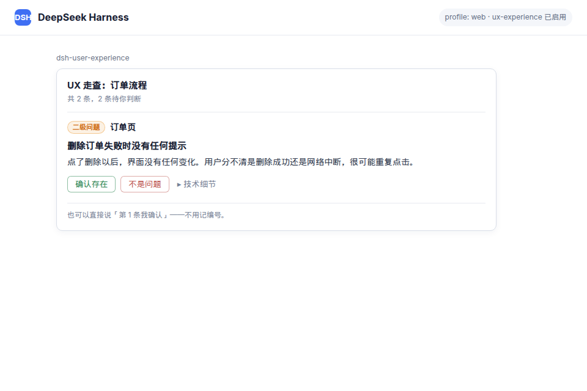
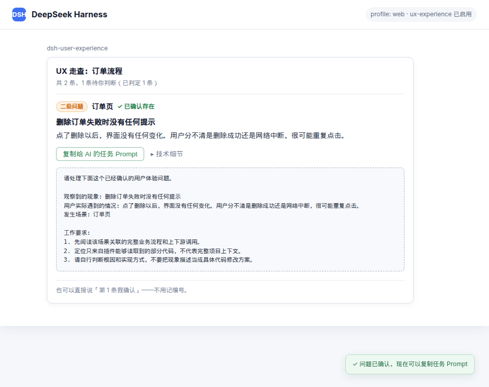

[English](README.md) · [简体中文](README.zh.md)

# dsh-user-experience

> A UX walkthrough plugin for DeepSeek Harness (DSH): **AI simulates target users to uncover UX problems during development—before they reach production—and provides concrete optimization suggestions.**
>
> Scope: React + TypeScript / React + JavaScript / Vue 3 supported, static evidence only, no visual issues.

Existing automated checks (axe, Lighthouse) can only verify absolute rules — contrast ratio, missing alt text. But UX issues are inherently **relative**: a confirmation dialog before deleting protects an occasional user but wastes the time of an operator who processes hundreds of records a day. Without knowing *who it's for*, a "UX issue" cannot be defined.

This plugin makes **target user personas** a prerequisite for the walkthrough: every finding is anchored to an explicit persona, and no persona means no conclusions. By having AI walk through the product as those users, it surfaces experience problems **during development** and gives concrete, locatable, reviewable optimization suggestions—not post-launch user feedback.

**It is a pipeline, not a CLI.** Edit a front-end file and the walkthrough runs itself — no command to remember, no step-by-step approvals. The report card leads with plain language (which page, what happened, how bad), and folds file paths and rule IDs into a "technical details" block you can copy straight to an AI in one click. Verdicts need no IDs either: click a button, or just say "the second one isn't a problem" or "ignore everything below level three".

## Install in Harness

In DeepSeek Harness, enter:

> Install the UX plugin in DeepSeek Harness: `dsh plugin --profile web add github:DietCokewithSugar/dsh-user-experience`

Or run the command directly:

```sh
dsh plugin --profile web add github:DietCokewithSugar/dsh-user-experience
```

Restart DSH or reload the `web` profile after installation. GitHub plugins execute build scripts during installation; read the [security note](#installation) before installing, and pin a trusted commit for production use.

## After installation

The walkthrough report explains the observed behavior and user impact in plain language:



Once you confirm that a finding is real, the card provides a task Prompt you can copy to another AI. It describes the observed phenomenon rather than prescribing code changes, tells the AI to inspect the complete project context, and explicitly allows copy changes:



---

## Scope (explicitly out of scope)

| Supported | Parsing engine |
|---|---|
| React + TypeScript (.ts / .tsx) | TypeScript compiler API (TSX) |
| React + JavaScript (.js / .jsx) | Same engine; .js may contain JSX, always parsed as TSX |
| Vue 3 (.vue SFC) | `@vue/compiler-sfc` block splitting + `@vue/compiler-dom` template AST; `<script>` / `<script setup>` blocks reuse the TypeScript engine, with line numbers remapped to the whole .vue file |

**Explicitly unsupported** (reported as-is, no low-quality guesses): Svelte, Vue 2 (SFC syntax is incompatible with @vue/compiler-sfc), mini-programs (.wxml), etc. See [`dsh-user-experience-v0.2-spec.md`](dsh-user-experience-v0.2-spec.md) for the stack-extension details and [`dsh-user-experience-v0.1.1-spec.md`](dsh-user-experience-v0.1.1-spec.md) for the form revision.

- Evidence level is fixed at **static** (source-code evidence); **no visual issues**: contrast, hit-target size, text truncation, focus order
- No automatic code changes: the plugin gives optimization suggestions; after you confirm a finding, it generates an observation-led task Prompt for a coding AI
- Input is source code only; website input (v0.3) and design-mockup input (v0.4) are reserved roadmap items

## Features

| Capability | Entry point | Description |
|---|---|---|
| Persona init | `/ux init` | The model generates 1–3 persona drafts from README / package.json / route structure and writes them to `.ux/personas.yml` **after user confirmation**; loads directly when the file already exists, without re-asking |
| Persona context injection | automatic | Injects the active personas and walkthrough protocol into every request for the current project (aligned with the AGENTS.md section-provider pattern) |
| Source walkthrough | `/ux scan` | Confirms scope first (architecture docs take precedence, otherwise asks for the feature/flow), then walks each persona independently and merges into one report; 9 high-confidence rules, model judgment first with AST verification as support |
| **Change-triggered walkthrough** | automatic | After you edit a front-end file, the turn wraps up by walking **the whole component / page that file belongs to** — not the changed lines (missing-state issues do not exist in a diff). Reports quietly; speaks up only for level-one / level-two issues |
| Report card | automatic | The first screen is plain language only: `[Level one] Admin page` + one sentence on what happened + what the user runs into. File paths, rule IDs and internal numbering live behind "technical details", which expands to structured YAML you can copy to an AI in one click |
| Finding confirmation loop | card buttons / plain speech | Click Confirmed / Not an issue, or just say "the second one isn't a problem", "those are all right", "ignore everything below level three" — **no ID is ever needed**; verdicts go to the session log and fully restore on replay |
| AI task Prompt after confirmation | card button | Once a user confirms a finding, copy a ready-to-use Prompt that describes the observed behavior, affected scenario, user impact, and acceptance goal. It does **not** prescribe code changes, warns that the plugin saw only part of the codebase, and allows UI copy edits |
| Implicit confirmation | automatic | If a finding disappears in a later walkthrough **and that location was actually re-scanned**, the user fixed it — so the finding was real. Nobody clicks anything, and the signal is harder than a button press |
| Report output | automatic | Markdown sorted by severity (**level one–four on screen; P0–P3 demoted to internal identifiers**), common issues (hit by ≥2 personas) first |
| Glossary | automatic | R-02 term verdicts persist incrementally to `.ux/glossary.yml`; later rounds only compare deltas |

### Three run modes, picked by context

| Mode | Behavior | When it applies |
|---|---|---|
| `auto` | Runs to completion, reports, never interrupts or asks for confirmation | CI / headless; **change-triggered walkthroughs** (the agent started it, so the agent digests it) |
| `review` | Reports, then offers one batch confirmation (tick several, submit together) | A user-initiated `/ux scan` |
| `interactive` | Confirms one finding at a time | Opt in manually when tuning rules |

Resolution order: explicit `--mode=` → `mode` in `.ux/rules.local.yml` → plugin config → context detection.

### The five-state finding machine

| State | Meaning |
|---|---|
| `pending` | Not judged yet |
| `confirmed_explicit` | The user clicked "Confirmed" |
| `confirmed_implicit` | Gone in a later walkthrough, and that location was genuinely re-scanned |
| `rejected` | The user clicked "Not an issue" |
| `stale` | That location was not scanned this round (or the code was deleted outright) — undecidable |

Both confirmed states count as effective findings in the metrics; `stale` is **excluded from the denominator** — "scanned and found nothing" must be distinguished from "never scanned", or deleting code gets misread as fixing it.

### The 9 rules

| ID | Rule | Verification path |
|---|---|---|
| R-01 | Error message without actionable guidance | model (AST only extracts error-branch copy) |
| R-02 | Inconsistent terminology (conditional: only when the round has no level-one / level-two issues) | model (AST only extracts candidate locations) |
| R-03 | Generic wording for irreversible actions | model |
| R-04 | Irreversible action without a confirmation step | model+ast |
| R-05 | Loading state without empty state | model+ast |
| R-06 | Success state without error state | model+ast |
| R-07 | Submit button not disabled while submitting | model+ast |
| R-08 | No fallback for long/overflow content | model+ast |
| R-09 | Dark/light mode adaptation missing | **ast** (fast lane, zero tokens) |

Severity is derived from a matrix: `impact` (does it block the persona's critical task; given by the model) × `reach` (share of target users affected; derived from the sum of `share` of hit personas, ≥0.5 is wide) → level one / two / three / four (still P0–P3 internally, never on screen).

### Repository file conventions

| File | Committed to git | Description |
|---|---|---|
| `.ux/personas.yml` | ✅ committed | Project-level consensus, team-shared; CI mode depends on it |
| `.ux/glossary.yml` | ✅ committed | Glossary and verdicts; high reuse value |
| `.ux/rules.local.yml` | ❌ gitignored | Personal walkthrough preferences, not imposed on the team. This version reads `mode` and `autoScan`; other keys are tolerated and ignored |
| `.ux/history.jsonl` | ❌ gitignored | Fingerprint ledger: fingerprint, first/last seen, terminal state, and each round's scope. This is **long-term metric data**, not verdicts |

Recommended addition to the project's `.gitignore`:

```gitignore
.ux/rules.local.yml
.ux/history.jsonl
```

Example preference file:

```yaml
# .ux/rules.local.yml
mode: review        # Pin the run mode; omit to pick by context
autoScan:
  enabled: true     # Change-triggered walkthrough switch
  debounceTurns: 1  # Minimum turns between two automatic walkthroughs
```

---

## Installation

> ⚠️ **Security note (must read)**
>
> Plugins installed from GitHub **run a build script on your machine at install time** (this repo builds its publish artifacts from source via a `prepare` script; on first `add`, pnpm ≥ 10 also asks you to explicitly allowlist that build in your profile's `pnpm-workspace.yaml`). This amounts to **granting the package permission to execute code during installation**, outside the agent sandbox.
>
> Therefore:
> 1. **Only install plugins from sources you trust** — installing is executing;
> 2. **Pin a commit** so later pushes cannot silently change the code that runs at install time:
>
> ```sh
> dsh plugin --profile <your-profile> add github:DietCokewithSugar/dsh-user-experience#<commit-sha>
> ```
>
> If you'd rather not grant build permission, install the prebuilt artifact from npm: `dsh plugin add dsh-user-experience`.

After installation, the plugin row (id `ux-experience`) enters the configuration layer; restart `dsh` or reload the profile to take effect. Available config options (overridden by id in the profile's `cordis.patch.yml` or the `--patch` layer):

```yaml
- id: ux-experience
  config:
    maxScanFiles: 300            # Max files collected per scan
    maxCandidatesPerRule: 5      # Max candidates per rule per file
    maxCandidatesPerFile: 25     # Total candidate cap per file
    maxFindings: 30              # Max findings per report
    excludePatterns: ['test', 'stories']   # Extra dirs to skip (on top of defaults)
    mode: detect                 # detect|auto|review|interactive (default: pick by context)
    autoScan: true               # Change-triggered walkthrough (on by default)
    autoScanEditTools: ['write', 'edit']   # Tool names counted as "file edits"
    autoScanMaxFiles: 20         # Max changed files pulled into one automatic walkthrough
    autoScanDebounceTurns: 1     # Minimum turns between two automatic walkthroughs
```

A user's `.ux/rules.local.yml` takes precedence over this layer.

## Usage

```text
/ux init                                        # Initialize target personas (draft → confirm → write)
/ux scan Order flow from selection to payment   # Start a walkthrough (confirm scope first, then walk per persona)
/ux scan Admin page --mode=auto                 # Pin the run mode (omit it and the mode is picked by context)
```

Once the report is up, **click the card buttons or just talk**:

```text
the second one isn't a problem
those are all right
ignore everything below level three
the delete one — I confirm it
```

After confirming a finding, click **Copy task Prompt for AI** on that card and paste it into your coding agent. The Prompt deliberately describes what users experience without guessing at the implementation from partial source context.

After editing front-end code you need do nothing at all: the walkthrough runs as the turn wraps up, reports quietly, and speaks up only for level-one / level-two issues.

## Development

```sh
pnpm install
pnpm run build     # tsdown (host half + client bundle) + tsc (type declarations)
pnpm test          # smoke tests (AST engine / persona / glossary / matrix / modes / fingerprints / ledger / end-to-end)
```

- **Version pinning**: DSH is in developer preview and its interfaces change. This repo pins `@deepseek-ai/dsh-*@0.1.0-rc.6` (`@deepseek-ai/cordis@4.0.1`); verify locally before upgrading the framework.
- Structure: `src/index.ts` is the Host plugin (commands + prompt injection + four model tools + the change-triggered walkthrough); `src/client/` is the Web client plugin (report card, discovered by the module table via the `dsh.client` declaration); one bundle row (`cordis.patch.yml`) mounts both.
- Red line: the agent loop is untouched — all capabilities hang on documented extension points (`ctx.commands` / `ctx.systemPrompt.section()` / `ctx.tools.register()` / `SessionEventMap` / `tools/result` / `agent/turn-stopping`). The automatic walkthrough uses the framework's own `/loop` shape: a listener calls `agent.steer()` at the turn's stop boundary and the machine re-reads its inbox for one more step.

## Publish checklist

- [x] README security note (see Installation above)
- [x] README declares the scope (React TS/JS + Vue 3, static evidence only, no visual issues)
- [x] v0.2 stack-extension spec (`dsh-user-experience-v0.2-spec.md`)
- [x] v0.1.1 form-revision spec (`dsh-user-experience-v0.1.1-spec.md`)
- [x] Pinned DSH dependency versions (developer preview)
- [x] Repo has the **`dsh-plugin`** topic (official discovery mechanism)
- [x] PR to [awesome-dsh-plugin](https://github.com/awesome-dsh-plugin/awesome-dsh-plugin), one line each in the English and Chinese READMEs (auto-synced to the site after merge) — [PR #63 merged](https://github.com/awesome-dsh-plugin/awesome-dsh-plugin/pull/63), [copy update PR #66](https://github.com/awesome-dsh-plugin/awesome-dsh-plugin/pull/66)
- [ ] Join the official Discord community (manual step; see the official docs/repo for the invite link)

## License

MIT
